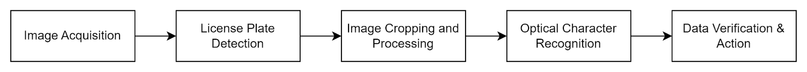
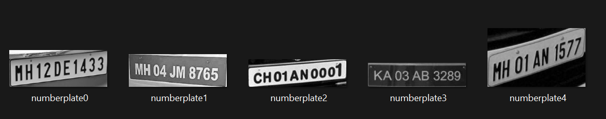
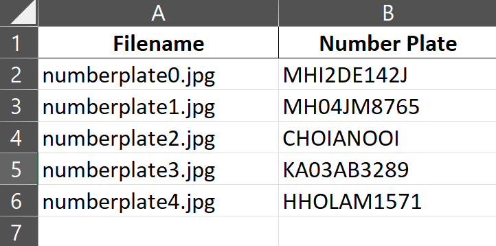

A license plate number is a unique identifier of a vehicle and its owner. This project involves the development of an ANPR system for gate control and vehicle monitoring.

This ALPR system captures images, runs a trained YOLOv7 model for object detection, identifies and crops license plates, applies OCR to extract the plate numbers, and finally tabulates a list of license plates.  Built for real-time operation, it utilizes a trained YOLOv7 model for accurate license plate detection and EasyOCR for character recognition. This cost-effective ANPR system holds promise for various applications such as gate control and access management, traffic monitoring, and aiding law enforcement in identifying stolen vehicles. 

To run ALPR using the trained model, first clone this repository and cd into the cloned repository.
Then use the following commands:

```bash
cd yolov7
pip install -r requirements.txt
python detect.py --weights best.pt --conf 0.8 --source path/to/your/LPimage_or_imagefolder
```
The cropped images and the list of their corresponding license plate names will be saved in the `yolov7/cropped_image` folder.

## System Implementation
1. **Data Acquisition and Annotation**: A custom dataset of 650 images of vehicles with Indian license plates was created, annotated using Roboflow, and augmented to over 1600 images.
2. **Model Training and Refinements**: YOLOv7 model was trained on the dataset for 40 epochs to achieve high accuracy in license plate detection
3. **Optical Character Recognition (OCR)**: EasyOCR was used for character recognition from the cropped license plate images.
4. **Hardware Setup and Deployment**: Raspberry Pi 4 was used as the edge device, interfacing the camera module for real-time image capture.

### ALPR Pipeline



## Results



